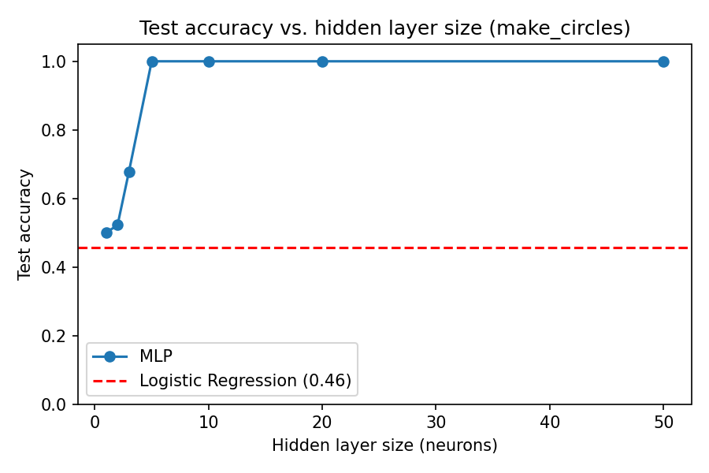
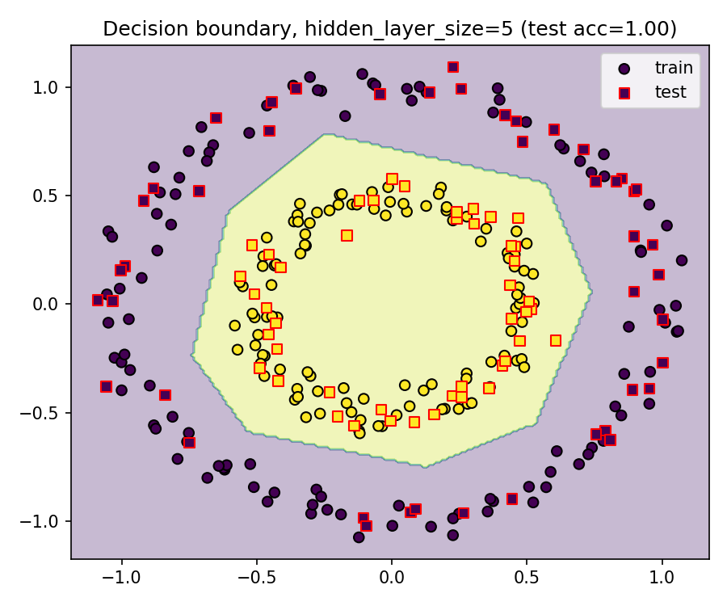

# Project 1: Linear vs. Non-Linear Classification on `make_circles`

Exercise from the Oracle Cloud Infrastructure (OCI) AI Foundations course
(completed November 2025), extended here with an actual train/test
evaluation and a linear-vs-neural-network comparison.

## Question

`make_circles` generates two classes arranged as interlocking circles — a
textbook non-linearly-separable dataset. The claim worth testing: **does a
linear model actually fail here, and does a small neural network actually
fix it?**

## Method

- Data: `sklearn.datasets.make_circles(n_samples=300, noise=0.05, factor=0.5)`
- Split: 70/30 train/test, stratified, fixed random seed
- Models compared:
  - `LogisticRegression` (linear baseline)
  - `MLPClassifier`, single hidden layer, ReLU, swept over `{1,2,3,5,10,20,50}` neurons
- Metric: accuracy on the held-out test set (not training accuracy)

## Results

| Model | Test accuracy |
|---|---|
| Logistic Regression (linear) | 0.456 |
| MLP, 1 neuron | 0.500 |
| MLP, 2 neurons | 0.522 |
| MLP, 3 neurons | 0.678 |
| MLP, 5 neurons | **1.000** |
| MLP, 10–50 neurons | 1.000 |

(Exact numbers reproduce deterministically — see `results/metrics.json`
after running `train_classifier.py` or the notebook.)




**Finding:** the linear model performs at essentially chance level (its
accuracy is not meaningfully above 0.5 given only 90 test points), while the
MLP needs as few as 5 hidden neurons to separate the classes perfectly on
held-out data. This is the concrete evidence for the qualitative claim the
exercise is built around, rather than an assertion.

## What's in this folder

```
01_Building_Classifier/
  01_mlp_make_circles.ipynb   <- full walkthrough + interactive slider (Jupyter)
  train_classifier.py         <- CLI script version, no notebook required
  requirements.txt
  results/                    <- generated by running either of the above
    metrics.json
    accuracy_vs_hidden_size.png
    decision_boundary.png
    best_mlp_model.joblib
```

## Reproducing this

```bash
pip install -r requirements.txt
python train_classifier.py                      # default settings
python train_classifier.py --hidden-sizes 1 5 10 20 --noise 0.1   # custom sweep
```

or open `01_mlp_make_circles.ipynb` in Jupyter for the interactive version
with the adjustable hidden-layer slider.

## Limitations

- `make_circles` is synthetic data with a known ground-truth structure — a
  clean win for MLP here doesn't generalize to noisier, real-world,
  higher-dimensional data. Project 2 in this repository tests the same
  linear-vs-non-linear question on real biological data, where the answer
  is not as clean.
- Single random seed for the train/test split; not cross-validated (dataset
  is easy enough that this doesn't change the conclusion, but it's worth
  being explicit about).

## Course context

Oracle Cloud Infrastructure (OCI) AI Foundations Associate — Module 4,
Deep Learning Foundations. Completed 11 Nov 2025.
