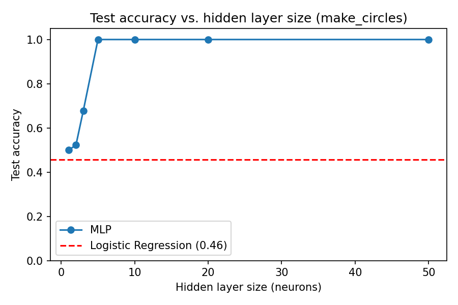
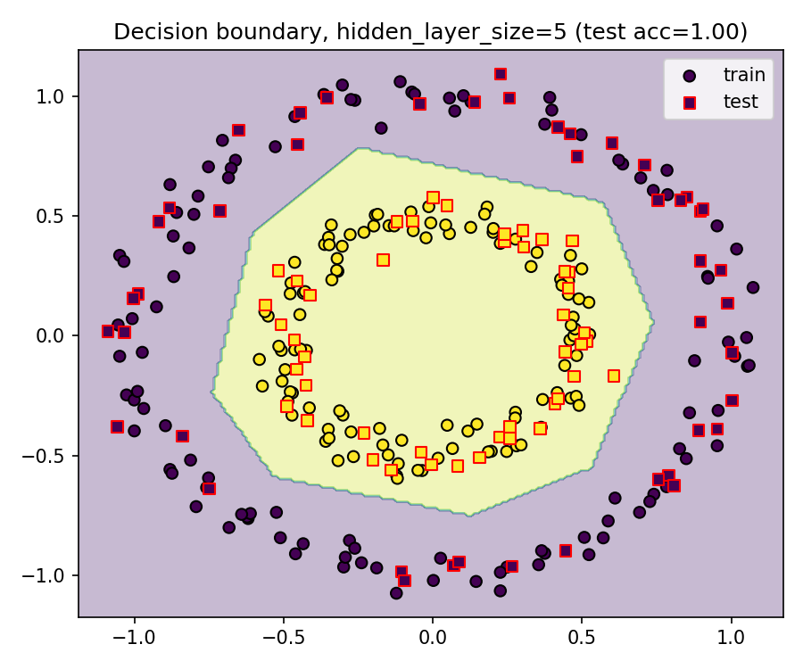
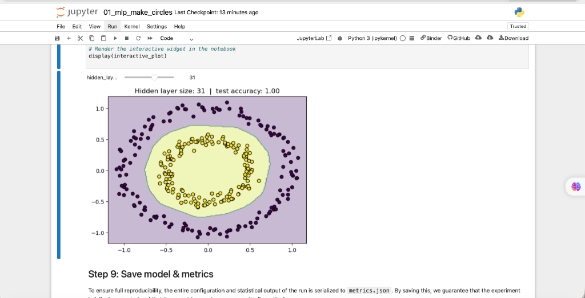

# Results, Interpretations, and Conclusions

This document summarizes the findings from the synthetic non-linear classification pipeline (`make_circles`). The results and metrics analyzed below are generated by executing `train_classifier.md` (or equivalently, following the interactive steps in `01_mlp_make_circles.ipynb`).

**Dataset Overview:**
The dataset fed into this pipeline consists of 300 synthetically generated data points arranged as two interlocking, concentric circles. It is specifically designed to be non-linearly separable.

---

## 1. Accuracy vs. Hidden Layer Size

*(Generated by executing **Step 6: Plot 1 - Accuracy vs. hidden layer size**)*

We evaluated a Logistic Regression (linear baseline) model alongside a Multi-Layer Perceptron (neural network) sweeping across various hidden layer capacities (from 1 to 50 neurons).

**Interpretation:**
- **Linear Failure:** The Logistic Regression baseline (red dashed line) failed completely, hovering around chance-level accuracy (~50%). A single straight line cannot separate concentric circles.
- **Neural Network Success:** The MLP with a single neuron performed identically to the linear model. However, as the hidden layer size increased, the neural network gained the capacity to learn non-linear boundaries. At just 5 neurons, it achieved perfect 100% test accuracy on the held-out validation cohort. 

## 2. Decision Boundary

*(Generated by executing **Step 7: Plot 2 - Decision boundary for the best model**)*

To understand exactly how the MLP solved the problem, we mapped a dense grid of points across the feature space and plotted the optimal model's predictions.

**Interpretation:**
- The image shows the contour map of the neural network's decision space. The inner circle is perfectly encapsulated by a smooth, continuous circular boundary learned by the MLP.
- The model didn't just memorize the individual training points; the smooth boundary proves it mathematically learned the underlying geometric distribution of the data. It successfully combined multiple linear transformations into a curved shape.

## 2.1 Interactive Decision Boundary (Jupyter)

*(Generated by executing **Step 8: Interactive Exploration** in the notebook)*

The Jupyter notebook version features an interactive widget (`ipywidgets`) allowing users to dynamically sweep the hidden layer size. This visualizes exactly how the neural network mathematically flexes and wraps around the data in real-time as capacity (number of neurons) is increased.

## 3. Metrics Serialization (`metrics.json`)

*(Generated by executing **Step 8: Save model & metrics**)*

To ensure full reproducibility, the entire configuration and statistical output of the run is serialized to `metrics.json`.

**What `metrics.json` contains:**
- **`dataset`**: Metadata about the generator used (`sklearn.datasets.make_circles`) and its parameters (300 samples, 0.05 noise, 0.5 factor).
- **`split`**: The exact parameters used for the train/test split (70/30, stratified, fixed random state).
- **`baseline_logistic_regression_test_accuracy`**: The exact accuracy achieved by the linear baseline.
- **`hidden_layer_sweep`**: A detailed array containing the exact test accuracy achieved for every single hidden layer size tested (1, 2, 3, 5, 10, 20, 50).
- **`best_hidden_layer_size`**: The optimal configuration found during the sweep.

By saving this, we guarantee that the experiment is fully documented and that these metrics can be programmatically audited.

## 4. Final Conclusion

*(Generated by executing **Step 9: Final Conclusion**)*

This project successfully demonstrated the fundamental flaw of strictly linear models. 

When presented with non-linear, circular data, Logistic Regression failed completely. However, by adding a hidden layer of neurons (a Multi-Layer Perceptron), the model was able to combine multiple linear transformations to create a highly flexible, non-linear decision boundary, perfectly separating the two classes!

**Key Takeaway:** In a real-world context, many relationships (like diagnosing diseases from biomarkers or predicting complex customer behaviors) are not linear. Using a strictly linear model on complex data can lead to total failure. This project validates why neural networks are the foundation of modern deep learning—their ability to bend and wrap around non-linear data spaces is unmatched.
