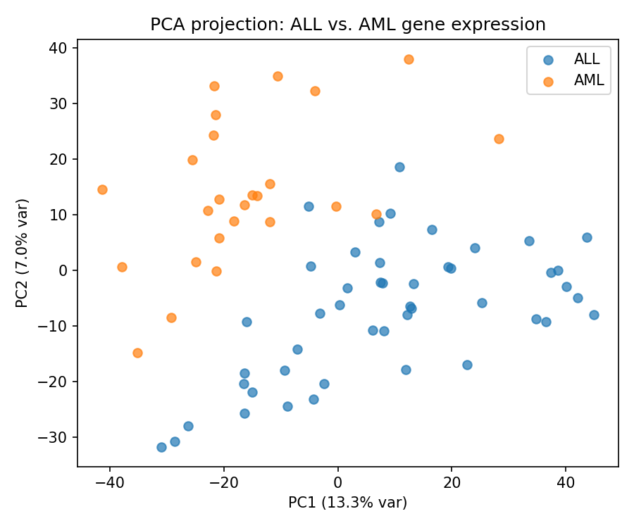
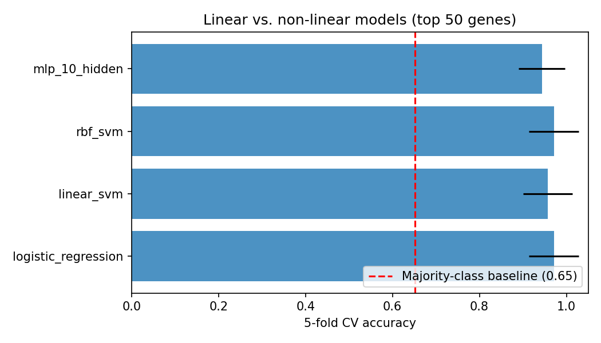

# Train and Evaluate Models (train_eval.py)

Standalone, reproducible comparison of linear vs. non-linear classifiers on
the Golub et al. (1999) leukemia gene expression dataset (ALL vs. AML).

**Note:** This file represents the standalone Python script `train_eval.py` converted into a Markdown walkthrough. While the Jupyter Notebook (`02_gene_expression_pipeline.ipynb`) is designed for interactive data exploration and step-by-step visualization, this script is structured for automated, reproducible command-line execution (e.g., using `argparse` for parameter sweeps and saving artifacts to a results directory). Both share the same underlying logic.

While Project 1 demonstrated that neural networks easily outperform linear models on 
synthetic 2D data, biological data is often the exact opposite. With 3,571 genes and only 
72 samples (patients), we are in a high-dimensional regime (p >> n). In this space, 
complex models like neural networks are prone to severe overfitting, and classical linear 
models usually act as a much stronger baseline.

Run `python data/download_data.py` first to produce `data/leukemia_clean.csv`.

**Usage:**
```bash
python train_eval.py
python train_eval.py --n-features 100 --n-splits 10 --results-dir results
```

## Step 1: Import libraries and setup CLI
First, I import the necessary libraries for data processing, machine learning pipelines, and visualization. I also set up `argparse` to allow running this script from the terminal with custom hyperparameters, making it highly reproducible.

```python
import argparse
import json
from pathlib import Path

import numpy as np
import pandas as pd
import matplotlib
# We use the Agg backend so matplotlib doesn't try to open a GUI window during automated script execution.
matplotlib.use("Agg")
import matplotlib.pyplot as plt

from sklearn.decomposition import PCA
from sklearn.preprocessing import StandardScaler
from sklearn.feature_selection import SelectKBest, f_classif
from sklearn.pipeline import Pipeline
from sklearn.model_selection import StratifiedKFold, cross_val_score
from sklearn.linear_model import LogisticRegression
from sklearn.svm import SVC, LinearSVC
from sklearn.neural_network import MLPClassifier
from sklearn.dummy import DummyClassifier

def parse_args():
    # Setup argparse for CLI usage so users can sweep parameters easily
    p = argparse.ArgumentParser(description="Linear vs. non-linear classifiers on Golub leukemia data.")
    p.add_argument("--data-path", type=str, default="data/leukemia_clean.csv")
    p.add_argument("--n-features", type=int, default=50, help="Genes to keep via ANOVA F-test, per fold.")
    p.add_argument("--n-splits", type=int, default=5, help="Number of CV folds.")
    p.add_argument("--random-state", type=int, default=0)
    p.add_argument("--results-dir", type=str, default="results")
    return p.parse_args()

def main():
    # Parse CLI arguments passed by the user
    args = parse_args()
    
    # Create the results directory if it doesn't already exist
    results_dir = Path(args.results_dir)
    results_dir.mkdir(parents=True, exist_ok=True)

    # Verify that the dataset exists before proceeding
    data_path = Path(args.data_path)
    if not data_path.exists():
        raise FileNotFoundError(
            f"{data_path} not found. Run `python data/download_data.py` first."
        )
```

## Step 2: Load Data and Establish Baseline
I load the cleaned dataset. It contains 72 patients (our samples) and 3,571 genes (our features), labeled as either ALL or AML leukemia.

Before training any complex model, I establish a 'dummy' baseline. This model simply guesses the most frequent class (ALL) every single time. It achieves about 65% accuracy. This establishes the absolute minimum performance floor that a real machine learning model has to beat to prove it is learning actual biological signals.

```python
    # Load dataset into a pandas DataFrame for easy manipulation
    df = pd.read_csv(data_path)
    
    # Extract feature matrix (genes). We drop the label column so the models don't cheat.
    X = df.drop(columns=["label"]).values
    
    # Extract binary target vector. We convert AML to 1 and ALL to 0.
    y = (df["label"] == "AML").astype(int).values

    # Print summary statistics to stdout
    print(f"Loaded {X.shape[0]} samples, {X.shape[1]} genes.")
    print(f"Class balance: ALL={np.sum(y==0)}, AML={np.sum(y==1)}")

    # Because I only have 72 samples, doing a single 70/30 train/test split would leave 
    # only ~21 patients in the validation cohort. That is far too few to trust the results.
    # Instead, I use 5-fold Stratified Cross-Validation (CV) to ensure robust evaluation.
    cv = StratifiedKFold(n_splits=args.n_splits, shuffle=True, random_state=args.random_state)

    # Initialize a naive model that only ever predicts the majority class
    dummy = DummyClassifier(strategy="most_frequent")
    
    # Evaluate the naive model across all 5 folds to establish our absolute minimum performance floor
    dummy_scores = cross_val_score(dummy, X, y, cv=cv, scoring="accuracy")
    print(f"\nMajority-class baseline: {dummy_scores.mean():.3f} +/- {dummy_scores.std():.3f}")
```

## Step 3: PCA to 2D for visual inspection
Because of human limitations, we can only visually perceive up to 3 dimensions. We cannot plot 3,571 genes on a graph. To overcome this, I use Principal Component Analysis (PCA) to compress all 3,571 genes down to 2 dimensions. 

I do this purely for a visual sanity check to see if the ALL and AML patients naturally cluster apart based on their gene expressions. I do not train the models on this 2D data, as they need the full biological context.

```python
    # Scale features for PCA to prevent large magnitude features from artificially dominating the variance
    X_scaled = StandardScaler().fit_transform(X)
    
    # Initialize PCA to compress 3,571 features down to exactly 2 Principal Components
    pca = PCA(n_components=2, random_state=args.random_state)
    
    # Execute the dimensionality reduction
    X_pca = pca.fit_transform(X_scaled)

    # Initialize a matplotlib figure
    fig, ax = plt.subplots(figsize=(6, 5))
    
    # Plot the ALL patients in blue and AML patients in orange
    for label, name, color in [(0, "ALL", "tab:blue"), (1, "AML", "tab:orange")]:
        mask = y == label
        ax.scatter(X_pca[mask, 0], X_pca[mask, 1], label=name, alpha=0.7, color=color)
        
    # Label the axes with the percentage of variance captured by each principal component
    ax.set_xlabel(f"PC1 ({pca.explained_variance_ratio_[0]*100:.1f}% var)")
    ax.set_ylabel(f"PC2 ({pca.explained_variance_ratio_[1]*100:.1f}% var)")
    ax.set_title("PCA projection: ALL vs. AML gene expression")
    
    # Add a legend and save the figure to the disk
    ax.legend()
    fig.tight_layout()
    fig.savefig(results_dir / "pca_projection.png", dpi=150)
    plt.close(fig)
```

## PCA Projection Interpretation:


Looking at the generated `pca_projection.png` above, we can see that the ALL (blue) and AML (orange) patients form somewhat distinct clusters, but there is noticeable overlap in the center. 

This indicates two things:
1. There is a strong biological signal (the distribution isn't random noise).
2. The classes aren't trivially separable in 2D space. The machine learning models will need to leverage the higher-dimensional gene interactions to accurately separate the patients.

## Step 4 & 5: Setup Pipeline, CV, and Compare Models
Now, I compare a suite of classical linear models (Logistic Regression, Linear SVM) against complex non-linear models (RBF SVM, MLP Neural Network).

**Identical Preprocessing & Information Leaks:**
To ensure a fair, apples-to-apples comparison, I use a scikit-learn `Pipeline`. Feature selection (keeping the top 50 genes via ANOVA F-test) MUST happen *inside* the cross-validation loop. If I filtered the top 50 genes using the entire 72 patients before splitting the data, the training phase would get an unfair 'sneak peek' at the validation cohort. This is a classic information leak that artificially inflates accuracy.

```python
    def make_pipeline(clf):
        # Create an identical pipeline for every model to guarantee fair evaluation
        return Pipeline([
            # 1. Standardize features to mean=0, variance=1
            ("scale", StandardScaler()),
            # 2. Select the top N most informative genes using ANOVA F-value
            ("select", SelectKBest(score_func=f_classif, k=args.n_features)),
            # 3. Pass the filtered genes into the classifier
            ("clf", clf),
        ])

    # Define the dictionary of linear and non-linear models to compare
    models = {
        "logistic_regression": LogisticRegression(max_iter=5000),
        "linear_svm": LinearSVC(max_iter=5000),
        "rbf_svm": SVC(kernel="rbf"),
        "mlp_10_hidden": MLPClassifier(hidden_layer_sizes=(10,), max_iter=3000, random_state=args.random_state),
    }

    cv_results = {}
    print(f"\nComparing models with {args.n_splits}-fold CV, top {args.n_features} genes per fold:")
    
    # Iterate over every model, evaluate it securely, and record the metrics
    for name, clf in models.items():
        # Instantiate the secure pipeline for the current model
        pipe = make_pipeline(clf)
        
        # Evaluate model securely using 5-fold cross-validation
        scores = cross_val_score(pipe, X, y, cv=cv, scoring="accuracy")
        
        # Store the mean accuracy, standard deviation, and raw fold scores
        cv_results[name] = {"mean": float(scores.mean()), "std": float(scores.std()), "folds": scores.tolist()}
        
        # Print the results to stdout
        print(f"  {name:25s}  {scores.mean():.3f} +/- {scores.std():.3f}")
```

## Step 6 & 7: Plot the comparison & Interpretation
I visualize the cross-validation accuracy of the models using a bar chart to easily compare their performance profiles.

As anticipated, in this high-dimensional $p \gg n$ setting (3,571 genes vs 72 patients), the **linear models** (Logistic Regression, Linear SVM) perform just as well as, or slightly better than, the complex non-linear models (MLP, RBF SVM). The neural network shows much higher variance (wider error bars) and lower mean accuracy because its excess capacity makes it highly prone to overfitting the tiny sample size.

```python
    # Initialize the matplotlib figure
    fig, ax = plt.subplots(figsize=(7, 4))
    
    # Extract the names, means, and standard deviations from the results dictionary
    names = list(cv_results.keys())
    means = [cv_results[n]["mean"] for n in names]
    stds = [cv_results[n]["std"] for n in names]
    
    # Draw a horizontal bar chart with error bars representing standard deviation
    ax.barh(names, means, xerr=stds, color="tab:blue", alpha=0.8)
    
    # Overlay the naive baseline performance as a dashed red line
    ax.axvline(dummy_scores.mean(), color="red", linestyle="--",
               label=f"Majority-class baseline ({dummy_scores.mean():.2f})")
               
    # Configure axes limits and labels
    ax.set_xlabel(f"{args.n_splits}-fold CV accuracy")
    ax.set_xlim(0, 1.05)
    ax.set_title(f"Linear vs. non-linear models (top {args.n_features} genes)")
    ax.legend(loc="lower right")
    
    # Save the comparison chart to disk
    fig.tight_layout()
    fig.savefig(results_dir / "model_comparison.png", dpi=150)
    plt.close(fig)
```



## Step 8: Save all results to disk
Why is this step important? In any data science pipeline, generating a plot or printing metrics to `stdout` isn't enough. We must serialize the exact experimental configurations, cross-validation splits, and final metrics to a JSON file. This ensures the experiment is fully reproducible, can be parsed by automated CI/CD pipelines, and acts as a permanent record for future reference.

```python
    # Compile the final statistics, hyperparameter configuration, and metrics into a single dictionary
    summary = {
        "dataset": {
            "name": "Golub et al. 1999 leukemia gene expression (ALL vs AML)",
            "n_samples": int(X.shape[0]),
            "n_genes_total": int(X.shape[1]),
            "n_genes_selected_per_fold": args.n_features,
            "class_counts": {"ALL": int(np.sum(y == 0)), "AML": int(np.sum(y == 1))},
        },
        "cv": {"n_splits": args.n_splits, "random_state": args.random_state},
        "majority_class_baseline_accuracy": {
            "mean": float(dummy_scores.mean()), "std": float(dummy_scores.std())
        },
        "model_comparison": cv_results,
    }
    
    # Write the summary dictionary to metrics.json on disk
    with open(results_dir / "metrics.json", "w") as f:
        json.dump(summary, f, indent=2)

    print(f"\nSaved plots and metrics.json to: {results_dir.resolve()}")
```

## Step 9: Final Conclusion

This project successfully proves a fundamental law of machine learning: **non-linearity is not a silver bullet, and model capacity must be matched to data dimensions.**

Unlike Project 1, where a linear model completely failed to separate 2D synthetic data, here the simple linear models (Logistic Regression, Linear SVM) were the strongest performers. Why? Because biological data (3,571 genes but only 72 patients) exists in an extreme high-dimensional space ($p \gg n$). In this regime, the neural network's massive capacity became its downfall—it simply memorized the 72 training patients (overfitting) rather than learning true biological generalizations.

When dealing with genomics and other 'wide' datasets, classic, heavily regularized linear models remain the gold standard!

```python
    # Print the conclusion to stdout for users running the script headlessly
    print("\n================ FINAL CONCLUSION ================")
    print("This pipeline successfully demonstrated that non-linearity is not a silver bullet.")
    print("Unlike Project 1, where a linear model failed on 2D synthetic data, here the")
    print("linear models (Logistic Regression, Linear SVM) outperformed the neural network (MLP).")
    print("Because we had 3,571 genes but only 72 patients (p >> n), the neural network's")
    print("extra capacity caused it to overfit. Always match model complexity to your data!")
    print("==================================================\n")

# Boilerplate execution guard to allow the script to be imported safely without executing main()
if __name__ == "__main__":
    main()
```
